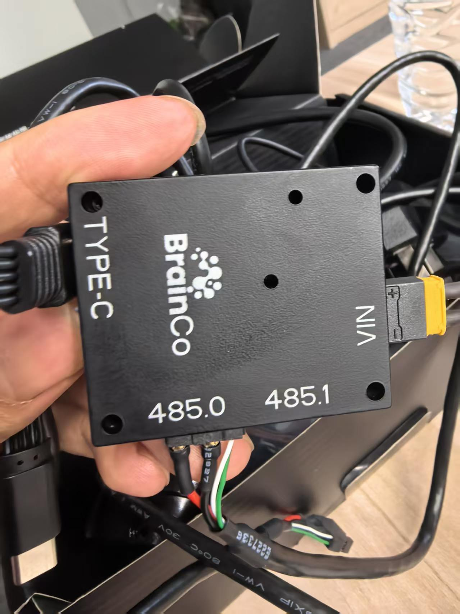
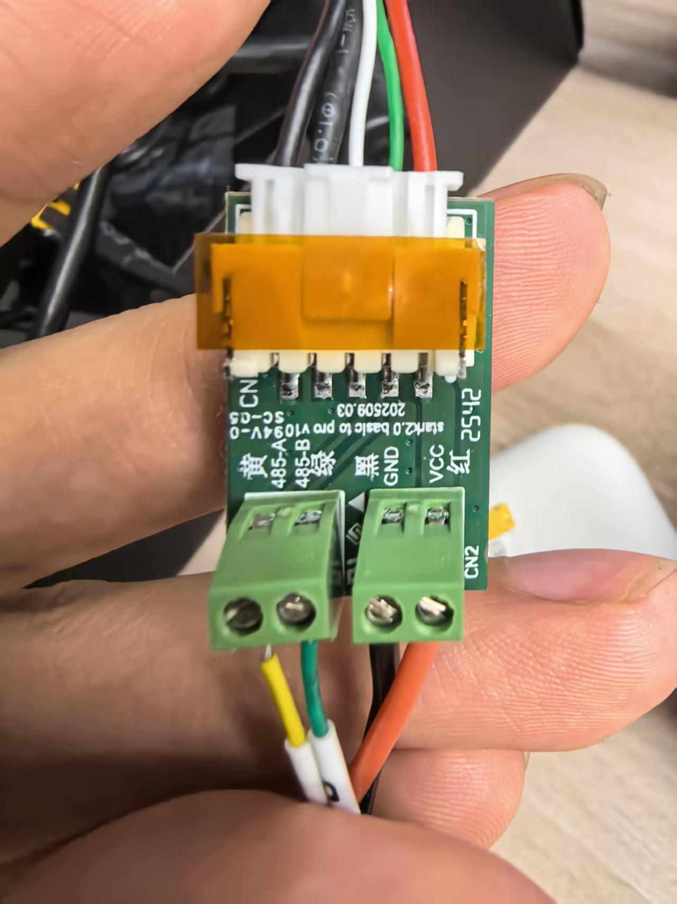

# Revo2 灵巧手硬件接线与上电操作手册

| 项目 | 内容 |
|---|---|
| 文档编号 | BXI-REVO2-HW-001 |
| 版本 | v1.0 |
| 编写 | 小陶（具身机器人研发实习生） |
| 适用硬件 | BrainCo Revo2 灵巧手（进阶版 / 触觉版，即 XEL/XER、XTL/XTR） |
| 适用机器人 | 半醒科技 BXirobotics 精灵 3（ELF 3） |
| 参考资料 | 见文末附录 B，全部为官方来源 |
| 最后更新 | 2026-09-20 |

> **本文目的**：把「拿到手不知道哪根线接哪只手、不会上电、不敢上电」这件事彻底讲清楚。
> 所有步骤按现场实操顺序排列，可以照着做一遍就通。
> 文中凡涉及会损伤硬件的操作，都单独用 ⚠️ 标出。

---

## 0. 阅读指南：先看你属于哪条路径

灵巧手有两套完全不同的接入方式，**接线、供电、上电顺序都不一样**。先定位自己：

| | 路径 A：整机接入（推荐） | 路径 B：独立调试 |
|---|---|---|
| 场景 | 灵巧手装在精灵 3 手臂上 | 灵巧手摆在桌面上，单机调试 |
| 供电来源 | 机器人手臂内的线缆直接供 58V | 官方标配电源适配器 |
| 通信方式 | 机器人主控板 CANFD（CAN5 / CAN6） | 485 或 CANFD 转 USB，接电脑 |
| 控制软件 | 精灵 3 的 ROS 2 环境 | Windows 官方上位机 / Python SDK |
| 上位机 | 机器人 NUC（Ubuntu 22.04） | 你的 Windows 电脑 |
| 本文对应章节 | 4.2 / 5.2 / 6.2 | 4.3 / 5.3 / 5.4 / 6.3 |

**你现在的情况（精灵 3 + Revo2 触觉版，硬件接线已完成）→ 走路径 A，重点看第 2、4.2、5.2、6.2 章。**

本手册的分工：

| 想知道 | 去哪 |
|---|---|
| Windows 和 Linux 各能做什么 | `00-环境边界与方案选型.md` |
| 接线、供电、上电、开关机 | **本文（01）** |
| Windows 上怎么单独调手 | `02-Windows单机调试指南.md` |
| 精灵 3 整机怎么远程控制手 | `03-ELF3整机ROS2联调指南.md` |
| 寄存器、协议帧格式 | `04-通信协议速查-Modbus与CANFD.md` |
| 报错了怎么办 | `05-故障排查手册.md` |
| 怎么把成果提交到公司仓库 | `06-Git协作与仓库规范.md` |

---

## 1. 适用范围与型号对照

Revo2 有三个版本，**供电和通信接口不同，接错会烧硬件**。先确认自己手里是哪一个。

| 版本 | 版本代号 | 供电电压 | 通信接口 | 静态电流 @24V | 空载平均电流 @24V | 最大电流 @24V |
|---|---|---|---|---|---|---|
| 基础版 | XRL / XRR | **12–28V** | 485、CANFD | 65 mA | 350 mA | 4.6 A |
| 进阶版 | XEL / XER | **12–64V** | 485、CANFD、EtherCAT | 115 mA | 390 mA | 4.65 A |
| 触觉版 | XTL / XTR | **12–64V** | 485、CANFD、EtherCAT | 115 mA | 390 mA | 4.65 A |

> ⚠️ **红色安全警告（官方原文）**：
> 「注意只有 Revo2 进阶版和触觉版支持 58V 电压，**切勿把基础版接入机器人**。」
>
> 原因是机器人手臂内的线缆**直接输出 58V**，只有进阶版 / 触觉版的硬件耐得住这个电压。
> 基础版上限 28V，接上去可能直接烧毁。

**怎么确认型号**：看手本体或包装盒上的完整型号标签。
触觉版可以从外观进一步确认：**触觉版指尖有触觉模块（传感器）**，进阶版没有。

> ⚠️ **型号命名差异待确认项**：官方文档支持列表写的是「Revo2 进阶版 / 触觉版」，
> 而零售渠道可能存在 `XTR2` 这类命名。**首次上电前**，建议把型号标签拍照发给
> 供应方（半醒 / 强脑）确认一句：
> 「XTR2 触觉版能否按 Revo2 方式接入 ELF3，CANFD + 58V 供电，ID 126/127？」
> 得到确认再上电。这是本文唯一可能烧硬件的地方，宁可多问一句。

---

## 2. 安全须知（上电前必读）

### 2.1 官方注意事项（产品手册原文，逐条）

1. 灵巧手不能置于高温、高湿环境中。
2. 请勿让灵巧手承受过大的负载和冲击。
3. 严禁在指尖施加过大的力。
4. 严禁用力拉扯手指。
5. 严禁将灵巧手靠近火焰。
6. 严禁将灵巧手置于易燃、易爆环境中。
7. 严禁在强电磁场环境中使用，如高压电线附近、大功率机器附近等。
8. 严禁用灵巧手去抓取过重、过热、尖锐、表面粗糙、有腐蚀性的物体。
9. 没有保护的情况下，严禁让灵巧手接触液体（酒、水、饮料等）和沙尘；如不慎接触，请立即断电，并联系售后。
10. 严禁私自拆解灵巧手，否则将导致保修条款失效。发生故障请联系售后。
11. 严禁用灵巧手操作危险机械。由此导致的人身伤害及财产损失，厂商不承担责任。

### 2.2 工程补充（我们自己踩过的坑，写进规范）

- **带电不插拔**。所有通信线、供电线一律**断电后**连接，接好再上电。
- **上电前手必须空载**。灵巧手上电会自动做位置校准（手指全张开），
  如果此时手里攥着东西，**物体会掉下来，也可能把手指别坏**。
- **运行动作程序前先清场**。握拳、捏合这类动作行程很大，
  确认手指活动范围内没有人体、线缆和易损物体。第一次测试建议机器人摆好、手朝外、人站侧面。
- **法兰螺钉不要拧太长**。见 3.5 节，拧过头会压裂内部多层板。
- **同一只手同时只能有一个程序在控制**。两个程序抢同一条总线，会出现随机无响应。

---

## 3. 硬件组成与接口识别

### 3.1 开箱清单（官方包装清单）

| 版本 | 灵巧手本体 | 标配通讯线 | 电源 | 选配工具 |
|---|---|---|---|---|
| 基础版 | 1 只 | 485/CANFD 通讯线 1 根 | 电源线 1 根 + 电源适配器 1 套 | — |
| 进阶版 / 触觉版 | 1 只 | 485/CANFD 通讯线 1 根 + **EtherCAT 通讯线 1 根** | 电源线 1 根 + 电源适配器 1 套 | 485 调试模块、CANFD 转 USB 模块、EtherCAT 调试模块、网线等 |

> 包装内通讯线按灵巧手版本标配。如需 EtherCAT 调试，还需要另外选配 EtherCAT 转网线模块。

**关于「485 调试模块」（桌面单机调试必用）**

上表「选配工具」一栏里的 485 调试模块，实物是**两件套**：

1. **485 转接盒** —— 黑色铝合金小盒，`BrainCo` 丝印，`TYPE-C` 接电脑、
   `VIN` 接独立供电、下方 `485.0` / `485.1` 两路独立输出；
2. **手腕转接小板** —— 绿色 PCB，`CN1` 6 pin 排线去手腕，
   `CN2` 两个绿色端子对应 `485-A`(黄) / `485-B`(绿) / `GND`(黑) / `VCC`(红)。

两件缺一不可，接线与通道判别见 **5.3 节**。

### 3.2 左右手判别（整机接入必看）

两只手互为镜像。判别方法：

**把手竖起来、掌心朝向自己——拇指在你右手边的那只，就是「左手」。**

整机接入的对应关系非常关键，记住一句话：

> **左手接左臂线，右手接右臂线。**

| 灵巧手 | ELF3 主控板接口 | 默认设备 ID | 协议 | master_id |
|---|---|---|---|---|
| **左手** | **CAN5** | 126（`0x7E`） | CANFD | 1 |
| **右手** | **CAN6** | 127（`0x7F`） | CANFD | 1 |

原理：机器人出厂时，主控板的 CAN5 / CAN6 两条总线已经**从躯干内部走线到手**，
所以左臂末端引出的那根细线就是 CAN5，右臂那根就是 CAN6。

> 接反了**不会烧硬件**（CAN 总线上接错只是通信不上），但程序会找不到手。
> 不确定就接上试，哪只手没反应就对调一次。

### 3.3 通信与供电接口

**接口位置：手腕下方。**

| 接口功能 | 接插件型号 | 备注 |
|---|---|---|
| RS485 | `A1257WV-S-2P-6T` | 与 CANFD 同型号，**按接口丝印区分，不要按外观猜** |
| CAN FD | `A1257WV-S-2P-6T` | 同上 |
| EtherCAT | `A1257WV-S-5P-6T` | 5 pin，与上面两个 2 pin 外观不同 |
| 电源 VCC | `XT30UPB-M` | XT30 接头，独立供电入口 |

**基础版与进阶/触觉版的接口差异（重要）：**

- **基础版**：只有 485 和 CANFD 两种通信方式。
- **进阶版 / 触觉版**：485、CANFD、EtherCAT **三种接口是物理上独立的三个接插件**，
  插哪个用哪个，不需要额外切换。

**这两个接口分别在什么场景用：**

| 场景 | 用哪个接口 | 中间还需要什么 |
|---|---|---|
| 整机装在精灵 3 上 | **CANFD** | 不需要额外模块，直接走机器人主控板 CAN5 / CAN6 |
| 桌面单机调试 | **485** | 需要 **BrainCo 485 调试模块**（转接盒 + 手腕转接小板）转成 USB |

> 换句话说：**「连电脑调」走 485，「连机器人用」走 CANFD**，两条路互不影响，
> 因为它们是两个独立的物理接插件。桌面调试那套转接盒在整机上完全用不到。
> 485 那一套的完整接线、通道判别方法见 **5.3 节**。

### 3.4 手背指示灯与按键

**手背灯状态定义（官方表）：**

| 灯效 | 含义 | 你要做什么 |
|---|---|---|
| 🟢 绿灯闪烁 | 开机中（**尚未完成复位**） | 等，不要发指令 |
| 🟢 绿灯常亮 | 正常工作（**已完成复位**） | 可以开始控制 |
| 🟡 黄灯闪烁 | **供电过低** | 立刻检查供电电压和线缆压降 |
| 🔵 青灯常亮 | OTA 升级中 | 绝对不要断电 |
| 🔴 红灯常亮 | 异常 | 断电，按第 9 章排查，必要时联系售后 |

**手背按键功能：**

| 操作 | 功能 |
|---|---|
| 短按 | 复位；**同时也是「手动位置校准」的触发方式**（见 4.5） |
| 长按 5 秒 | **恢复出厂设置** |
| 短按 2 次 | 装箱手势（官方英文手册作 Fist Gesture） |

> ⚠️ 长按 5 秒恢复出厂设置后：设备 ID 会恢复为左手 126 / 右手 127，
> RS485 波特率恢复 460800，CANFD 波特率恢复 5 Mbps。
> **如果现场已经改过 ID 或波特率，误触会让整条链路失配。** 别随手长按。

### 3.5 手腕机械接口

- 手腕接口处通过 **4 颗 M3 螺钉**周向固定。
- ⚠️ **进阶版和触觉版的手腕法兰螺纹通孔深度为 3.5 mm，
  建议螺钉旋入手腕端的深度小于 3 mm**，否则会**顶到并压裂内部多层电路板**。
- 手腕接口图纸和 3D 模型可从官方文档中心下载：
  <https://www.brainco-hz.com/docs/revolimb-hand/revo2/download.html>

---

## 4. 供电与电源开关操作

### 4.1 供电规格

| 项目 | 基础版 | 进阶版 / 触觉版 |
|---|---|---|
| 额定供电范围 | 12–28V | **12–64V** |
| 静态电流 | 65 mA @24V | 115 mA @24V |
| 空载平均电流（五指屈伸） | 350 mA @24V | 390 mA @24V |
| 最大电流 | 4.6 A @24V | 4.65 A @24V |

要点：

- **电源入口是手腕下方的 XT30 接头**（`XT30UPB-M`）。
- 官方标配的**电源适配器**用于独立调试；整机接入时不需要它。
- ⚠️ **灵巧手本体上没有一个「电源按钮」**。所谓「开关」指的是**上游的供电源头**：
  独立调试时是电源适配器/插排开关，整机接入时是**机器人本体的电源开关**。
  这一点很多人第一次找不到，会以为手坏了。

### 4.2 路径 A：整机接入的供电（精灵 3）

- **手由机器人手臂内的线缆直接供电 58V**，一根线同时承载 58V 供电 + CANFD 通信（二合一）。
- 手没有独立开关，**上电 = 机器人上电**。
- 供电链路：`机器人电池/电源 → 主控板 → 躯干内走线 → CAN5/CAN6 → 手臂末端线缆 → 灵巧手手腕接口`

**上电顺序（路径 A）：**

```
① 确认机器人已完全关机、断电
② 按 3.2 节确认左手线接左臂、右手线接右臂（防呆接口，插不进就转方向，不要硬怼）
③ 检查两根线没有绷紧、没有卡在关节活动处（手臂运动会扯线）
④ 启动机器人：开机自启动 ros_elf_launch.service 拉起遥控器程序
⑤ 按遥控器 Start 键（右摇杆按下）启动真机程序
⑥ 全身电机指示灯亮起，约 6 秒后自检通过、绿灯不熄
⑦ ★ 盯着灵巧手：硬件节点启动成功后，灵巧手通常会自动张开
   —— 这就是官方指定的「硬件链路第一步检查」
⑧ 手背灯应由绿灯闪烁转为绿灯常亮 = 复位完成
```

> ★ 第 ⑦ 步是本手册最重要的验收点。**手能自动张开 = 接线正确、供电正常、通信正常**，
> 一大半工作已经完成了。

### 4.3 路径 B：独立调试的供电

- 使用官方标配**电源适配器 + 电源线**，插到手腕下方的 **XT30 供电接口**。
- ⚠️ **先接线，后上电**：先把 XT30 接头插到底、通信线接好，再打开电源适配器开关 / 插排开关。
- ⚠️ 确认电源适配器输出电压在手的额定范围内（进阶版/触觉版 12–64V，基础版 12–28V），
  **不要随手拿一个 48V 的电源去接基础版。**

**上电顺序（路径 B）：**

```
① 手平放在桌面上，手指活动范围内清空，手不要攥任何东西
② 接好 XT30 供电线（插到底，XT30 有防呆方向）
③ 接好通信线：手腕转接小板 CN1 排线插到底、卡扣压好；
   转接盒那端的 Type-C **先不插电脑**（要等手上电完成，见 5.3.3）
④ 打开独立电源开关 / 插排开关（转接盒 VIN 同时上电）
⑤ 观察手背灯：绿灯闪烁 → 手指依次张开（位置校准）→ 绿灯常亮
⑥ 绿灯常亮后，再把 Type-C 插到电脑，然后开上位机 / 跑程序
```

**断电顺序（路径 B）：**

```
① 先在软件里停止动作程序 / 关闭上位机连接
② 确认手指已张开、不在抓握状态、电机无堵转
③ 拔掉 Type-C（与电脑断开）
④ 关闭独立电源开关 / 插排开关
⑤ 最后拔通信线与供电线
（顺序反了会让手停在半握状态，下次上电校准会「弹」一下，长期对结构不友好）
```

### 4.4 上电后必须做的事：位置校准

这是新人最容易漏的一步，官方手册用 Note 单独强调：

> **Note：在灵巧手上电后，必须执行一次位置校准，才能正常控制。**

- **开机自复位（默认开启）**：上电后灵巧手自动查找手指起始位置，
  期间**所有手指都会被打开**。注册表 `1068` 控制这个行为，默认值为 `1`（开启）。
- 如果 `1068` 被设为 `0`（关闭自动校准），就需要**手动校准**，两种方式：
  1. 写寄存器 `1069`（位置校准）；
  2. **上电后短按手背灯按键**。

> ⚠️ 校准期间如果手上有抓握物体，存在**物体跌落**风险。

### 4.5 上电异常判读

| 现象 | 最可能原因 | 先做这一步 |
|---|---|---|
| 手完全不亮、无任何反应 | 供电没到 | 量 XT30 输入端电压；检查适配器开关、保险丝 |
| 黄灯闪烁 | **供电过低** | 量负载下的实际电压，检查线径/线长导致的压降 |
| 红灯常亮 | 硬件异常 | 断电重启一次；仍红灯 → 联系售后 |
| 青灯常亮 | OTA 升级中 | 不要断电，等升级结束 |
| 绿灯一直闪烁不转常亮 | 复位/校准没完成 | 确认手指没被卡住、没抓东西；断电重上一次电 |
| 上电后手指不动但绿灯常亮 | 通信没通 | 转到第 5、9 章，先查通信链路 |

---

## 5. 通信接线

### 5.1 三种通信方式对比

| | RS485 | CAN FD | EtherCAT |
|---|---|---|---|
| 协议 | Modbus-RTU | CAN FD 扩展帧，数据段承载 Modbus-RTU | EtherCAT |
| 速率 | 常用 9600 bps ~ 1 Mbps（最高 10 Mbps） | 数据段可达 5 Mbps；仲裁域固定 1 Mbps | 高实时、低延迟、精确同步 |
| 帧长度 | 可变长，软件需实现 CRC16 | 数据段最长 64 字节，**硬件内置校验** | — |
| 通信模式 | 半双工，需冲突检测 | 兼容传统 CAN 设备 | — |
| 校验 | **软件实现 CRC16 / checksum** | 硬件内置，无需软件实现 | — |
| 支持版本 | 基础版 / 进阶版 / 触觉版 | 基础版 / 进阶版 / 触觉版 | **仅进阶版 / 触觉版** |
| 多设备 | 一根总线可挂多只手或其它设备 | 同左 | — |

> ⚠️ **常见误区纠正**：网上流传「Revo2 靠手腕下方的拨码开关切换 CANFD / Modbus 协议」。
> 这句话**只对基础版成立**。官方手册原文：
> 「另外，Revo 2 **基础版**灵巧手可以通过拨码开关切换 CAN FD 和 Modbus-RTU 协议切换，
> 拨码开关在手腕下方（需拆开手腕件）。」
> **进阶版和触觉版没有这个拨码开关**——它的 485 / CANFD / EtherCAT 是三个独立的物理接口，
> 插哪个用哪个。拿触觉版去找拨码开关是找不到的。

### 5.2 路径 A：ELF3 整机 CANFD 接线

```
灵巧手（每只内置电机 + 触觉传感器 + 控制器，ID 左 126 / 右 127）
   │  一根线 = 58V 供电 + CANFD 通信（二合一）
   ▼
BXI 主控板（机器人躯干内，CAN5 接左手 / CAN6 接右手）
   │  PCIe
   ▼
NUC（机器人主脑，Ubuntu 22.04 + ROS 2 Humble）
   │  硬件节点把 CAN 数据变成 ROS 2 话题：/canfd_packet/rx  /canfd_packet/tx
   ▼
你要跑的程序（通过话题发指令，手就动）
```

**接线步骤：**

```
① 机器人完全关机断电（带电插拔总线设备有风险）
② 左手线缆 → 左臂末端引出的细线接头（即 CAN5），对准插紧
③ 右手线缆 → 右臂末端引出的细线接头（即 CAN6）
④ 检查线缆走向：不绷紧、不卡在关节活动处
⑤ 上电，按 4.2 节验证手是否自动张开
```

**通信参数（整机默认，与官方示例代码一致）：**

| 参数 | 值 |
|---|---|
| 总线 | 左 CAN5 / 右 CAN6 |
| 设备 ID | 左 126 / 右 127 |
| 协议 | CANFD |
| master_id | 1 |
| ROS 2 话题 | `/canfd_packet/rx`、`/canfd_packet/tx` |
| 消息类型 | `communication/msg/CANFDPacket` |

> **关于 CAN5 / CAN6 的编号，别和整机总线编号混了。**
> 本仓库 [`docs/hardware.md`](../../docs/hardware.md) 记录的是**机器人本体**的 5 条 CANFD 总线
> （bus 0–4：腰颈 / 左腿 / 右腿 / 左臂 / 右臂，共 31 个关节）。
> 灵巧手**不属于这 5 条总线**——它是独立的付费外设（hardware.md 中 Hands 一栏记为
> "Paid option, separate unit"），走 **BXI 主控板上另外两路 CANFD 接口 CAN5 / CAN6**。
> 所以两边编号不冲突，是两套不同的接口组：
>
> | 接口组 | 编号 | 用途 | 出处 |
> |---|---|---|---|
> | 本体总线 | CANFD 0–4 | 31 个本体关节 | `docs/hardware.md` |
> | 灵巧手接口 | CAN 5 / CAN 6 | 左 / 右手 | BXI 官方 wiki《外接灵巧手》 |
>
> ⚠️ `docs/hardware.md` 明确要求 **「Joint index → bus → CAN ID 表请查阅它，不要猜索引」**。
> 涉及本体关节编号的地方一律以那份文档为准，本文只负责灵巧手。

若现场接线不是默认的 CAN5/CAN6，或 ID 被改过，需要同步修改程序里的总线与 ID：

```python
# Python 示例：~/bxi_ws/bxi_revo2_example/src/bxi_revo2_example.py
left_ctx  = await init_bxipci_device(5, 126, master_id=1, is_canfd=True, ...)
right_ctx = await init_bxipci_device(6, 127, master_id=1, is_canfd=True, ...)
```

```cpp
// C++ 示例：~/bxi_ws/bxi_revo2_example/src/bxi_revo2_example.cpp
init_bxipci_device(&left_ctx_,  5, 126, true);
init_bxipci_device(&right_ctx_, 6, 127, true);
```

> 以上为官方示例原文（左右两手都列出来）。**本项目实机装配的是右手**，
> 因此实际使用 `right_ctx` 那一行（总线 6 / ID 127）；
> 本仓库脚本用 `--hand right` 即自动对应到这组参数。

### 5.3 路径 B：独立调试 —— 485 接线（BrainCo 485 调试模块）

桌面单机调试用的不是随手一个 USB 转 485，而是**强脑官方选配的「485 调试模块」**。
实物由两件组成，**缺一不可**：

| 部件 | 外观 | 位置 | 作用 |
|---|---|---|---|
| **485 转接盒** | 黑色铝合金小盒，正面 `BrainCo` 丝印 | 电脑侧 | 把电脑 USB 变成**两路独立 485** |
| **手腕转接小板** | 绿色 PCB，两个绿色 5.08 mm 端子 | 手侧 | 把 485 差分线 + 供电汇成一根排线去手腕 |

| 485 转接盒（电脑侧） | 手腕转接小板（手侧） |
|---|---|
|  |  |

#### 5.3.1 转接盒的四个接口

| 位置 | 丝印 | 接什么 |
|---|---|---|
| 左侧 | `TYPE-C` | Type-C 线 → 电脑 USB 口 |
| 右侧 | `VIN` | 独立供电输入（黄色插头） |
| 下方左 | `485.0` | 第 1 路 485 输出 |
| 下方右 | `485.1` | 第 2 路 485 输出 |

> **`485.0` / `485.1` 是两条完全独立的 485 总线**（电脑上表现为两个独立串口），
> 不是同一总线的两个接线柱。所以：一只手占一路，两只手互不干扰；只接一只手时另一路空着即可。

> ⚠️ **厂商标识里没有规定「485.0 = 左手、485.1 = 右手」。**
> 哪个口对应哪只手，**取决于你怎么插**，丝印只负责编号。
> 插完必须实测确认（见 5.3.4），**不要凭编号猜**。

#### 5.3.2 手腕转接小板的端子定义

小板丝印直接标了线色：

| 线色 | 丝印 | 信号 | 去向 |
|---|---|---|---|
| 黄 | `485-A` | RS485 差分 A | 转接盒对应路的 A |
| 绿 | `485-B` | RS485 差分 B | 转接盒对应路的 B |
| 黑 | `GND` | 信号地 | 转接盒 / 电源的 GND |
| 红 | `VCC` | 供电 | 独立电源 |

板上其余信息：

- `CN1` —— 6 pin 白色排线座（去手腕侧，插好后有橙色卡扣/胶带压住防脱）
- `CN2` —— 两个绿色 5.08 mm 端子：**左端子 = 485-A / 485-B，右端子 = GND / VCC**
- 板型丝印 `Rev 1.2.0 Basic 5.08`，生产批次 `202509.03`

#### 5.3.3 接线拓扑

```
① 通信链路
   电脑 USB 口
      │ Type-C 线
      ▼
   BrainCo 485 转接盒
      ├── 485.0 ── A / B ──┐   （A → 黄线，B → 绿线）
      └── 485.1 ── A / B ──┤
                           ▼
                    手腕转接小板（CN2 左端子：黄 / 绿）
                           │ CN1 · 6 pin 排线
                           ▼
                    灵巧手手腕通信接口

② 供电链路：两处都要供，别只供一处
   独立电源 ──▶ 转接盒 VIN（黄色插头）
   独立电源 ──▶ 手腕转接小板 VCC / GND（红 / 黑）
```

**接线顺序（全程断电操作）：**

```
① 全部断电：独立电源关闭，Type-C 先不插电脑
② 接 485 差分线：黄(A) / 绿(B) 接到转接盒对应那一路，GND 一并接上
③ 接供电：转接盒 VIN + 小板 VCC / GND
④ 插 CN1 6 pin 排线到手腕接口（插到底，橙色卡扣压好）
⑤ 打开独立电源 → 看手背灯：绿闪 → 手指自动张开 → 绿灯常亮
⑥ 最后插 Type-C 到电脑 → 电脑识别出串口
```

> ⚠️ **必须"先给手上电、再插 USB"**：手要走完上电复位校准（绿灯常亮）才会接受指令。
> 抢在前面发指令一定超时，而且会让你误判成"接线错了"，白查半天。

#### 5.3.4 通道判别：哪个口是哪只手（接好线后必做一次）

两路 485 各自独立，所以"哪只手在哪个口"只能实测。**用仓库自带工具，一次扫清：**

```bash
pip install pyserial                  # 首次需要
python tools/rs485_probe.py --list    # 先看电脑识别到几个串口
python tools/rs485_probe.py           # 自动扫描，直接给出「哪个口是哪只手」
```

`rs485_probe.py` 是**纯只读**工具：全程只发功能码 `0x03` / `0x04`，
不改设备 ID、不改波特率、不触发校准、不驱动电机，可以放心在第一次接线时就跑。

它替你回答三个问题：

1. `485.0` / `485.1` 分别枚举成了哪个 `COMx`；
2. 每路**实测的波特率和设备 ID**（出厂默认波特率 460800、ID 左 126 / 右 127，
   但被人改过就未必）；
3. 每个口上挂的是左手还是右手（读寄存器 `901`），并顺带读出固件版本、SN、触觉模块类型。

扫描结果会直接打印一段可以粘贴进 `config/hand_params.yaml` 的 YAML 片段。

**扫不出来时按这个顺序查**（脚本也会提示）：

| 顺序 | 查什么 | 判据 |
|---|---|---|
| 1 | 供电 | 手背灯绿灯常亮；黄灯闪 = 供电过低；完全不亮 = 没上电 |
| 2 | A/B 极性 | 接反**不会烧**，但一定不通 —— 对调一次再扫 |
| 3 | 共地 | 转接盒 GND 与手端 GND 是否连通；桌面调试务必接上 |
| 4 | 端口占用 | 官方上位机开着会独占串口，先关掉 |
| 5 | 参数被改过 | 加 `--full`：7 种波特率 × 地址 1–127 全量兜一遍 |

> **同一个 `COMx` 同一时刻只能被一个程序打开。**
> 想同时跑上位机和脚本，就把两只手分到两个不同的口上。

#### 5.3.5 485 电气与协议要点

- 485 是**差分总线**，区分 A、B 两线。A 接 A、B 接 B，**接反了通常通信不上但不会烧**。
- 总线两端（首尾设备）通常需要 120Ω 终端电阻，视线长和模块而定。
- 默认串口参数（出厂）：**波特率 460800、8 数据位、1 停止位、无校验**，
  从机地址 = 设备 ID（左 126 / 右 127）。
- 波特率可改，寄存器 `1001`：

| 写入值 | 0 | 1 | 2 | 3 | 4 | 5 | 6 |
|---|---|---|---|---|---|---|---|
| 波特率 | 115200 | 57600 | 19200 | 460800 | 1000000 | 2000000 | 5000000 |

- ⚠️ 485 的 CRC16 **需要软件实现**（CANFD 是硬件校验）。自己写代码时别漏了校验。

> ⚠️⚠️ **桌面调试期间不要改设备 ID 和波特率。**
> 手上的 ID / 波特率是"一只手套一套参数"。桌面把它改成 1、等装回机器人时忘了改回来，
> 整机联调（走 CANFD，期望左 126 / 右 127）就会**找不到手**，而且现象很像硬件故障。
> 确实要改，改完立刻记进 `config/hand_params.yaml`。
> 万一已经改了：**长按手背按键 5 秒恢复出厂设置**（ID 复位 126/127，485 波特率复位 460800），
> 或写寄存器 `1000` / `1001` 改回来。

#### 5.3.6 待确认项（对着随货接线图核对一次即可）

以下是照片里拍不到、需要对着随货图纸或万用表确认的两点。
**不影响按上文接线**，但值得核对一次：

| # | 待确认 | 怎么确认 |
|---|---|---|
| 1 | 转接盒 `485.0` / `485.1` 出线接插件的针序（哪针是 A / B / GND） | 断电，万用表通断挡从盒内追踪；或直接按「黄→A、绿→B、黑→GND」接，用 5.3.4 的扫描验证 |
| 2 | 手腕转接小板 `CN1` 6 pin 与手腕接口的对应关系 | 核对随货接线图；或断电用通断挡量 `CN1` 各针与 `CN2` 四个端子的对应 |

> 这两点的**兜底验证手段是同一个**：接上后跑 `python tools/rs485_probe.py`。
> 扫得出设备 = 接线对；扫不出 = 按 5.3.4 的顺序表逐条查。
> **不需要一步到位猜准针序** —— 有自验证闭环，试错成本极低。

### 5.4 路径 B：独立调试 —— CANFD 接线

```
电脑 USB 口
   │  USB 转 CANFD 模块（官方推荐 ZLG USBCANFD-200U 一类）
   ▼
CAN_H / CAN_L 差分线（+ 可选 GND）
   ▼
灵巧手手腕下方 CANFD 接口（A1257WV-S-2P-6T）
   （同时 XT30 独立供电）
```

要点：

- **仲裁域波特率固定 1 Mbps**，不要改；数据段波特率可配（寄存器 `1002`）。
- CANFD 波特率表（寄存器 `1002`）：

| 值 | 0 | 1 | 2 | 3 | 4 | 5 | 6 | 7 | 8 | 9 | 10 |
|---|---|---|---|---|---|---|---|---|---|---|---|
| 波特率 | 100k | 125k | 200k | 250k | 400k | 500k | 800k | **1M** | 2M | 4M | **5M** |

  出厂默认：**5 Mbps**。

- 仲裁域采样点可配（寄存器 `1003`）：`0` = 1000 kbps / 75%，`1` = 1000 kbps / 80%。
- CAN 总线同样需要两端终端电阻（通常 120Ω）。
- 29 位扩展帧 ID 携带设备信息：`bit16~23` = Device ID，`bit8~15` = Master ID，
  `bit0~7` = Payload 长度；数据段内容就是完整的 Modbus-RTU 帧。
  详见 `04-通信协议速查-Modbus与CANFD.md`。

### 5.5 接线自检表（每次动过线都过一遍）

**通用**

- [ ] 供电：XT30 插到底 / 手臂线接头插紧，无松动
- [ ] 供电电压在型号额定范围内（基础版 ≤28V；进阶/触觉版 ≤64V）
- [ ] 通信线 A/B（或 CAN_H/CAN_L）无接反、无虚接
- [ ] 线缆没有被关节、外壳夹住，没有绷紧
- [ ] 没有第二个人/第二个程序在同时控制同一只手
- [ ] 手腕法兰螺钉旋入深度 < 3 mm

**整机（路径 A）**

- [ ] 左右手与总线对应：左手 → CAN5，右手 → CAN6

**桌面 485（路径 B）**

- [ ] 转接盒 `VIN` 已接独立供电（不是指望 Type-C 供电带得动手）
- [ ] 手腕转接小板 `VCC` / `GND` 已接（红 / 黑）
- [ ] `485-A`(黄) / `485-B`(绿) 与转接盒对应那一路**同极性**
- [ ] 转接盒 GND 与手端 GND 共地
- [ ] `CN1` 6 pin 排线插到底、橙色卡扣压好
- [ ] 上电顺序正确：**先给手上电（绿灯常亮）→ 再插 Type-C 到电脑**
- [ ] 上位机已关闭（否则串口被占用）
- [ ] 设备 ID / 波特率没被改过（改过也记进 `config/hand_params.yaml`）

---

## 6. 上电后首次验证流程

### 6.1 通用第一步

**看手背灯 → 绿灯常亮**；**看手指 → 已自动张开**。
这两条都满足，说明供电和自检通过。

### 6.2 路径 A（整机）验证：跑官方示例

在**机器人 NUC** 上执行（逐行）：

```bash
# ① 确认硬件节点话题在
source /opt/ros/humble/setup.bash
source /opt/bxi/bxi_ros2_pkg/setup.bash
ros2 topic list | grep canfd_packet
#   期望输出：/canfd_packet/rx  /canfd_packet/tx

# ② 切到 root 并设置 ROS 2 通信环境（硬件节点跑在 root 下，必须一致）
sudo su
export ROS_DOMAIN_ID=<机器人的DOMAIN_ID>
export RMW_IMPLEMENTATION=rmw_cyclonedds_cpp
export ROS_LOCALHOST_ONLY=0
export CYCLONEDDS_URI='<CycloneDDS><Domain Id="any"><General><Interfaces><NetworkInterface name="lo" multicast="true"/></Interfaces><AllowMulticast>true</AllowMulticast></General></Domain></CycloneDDS>'

# ③ 跑示例
cd ~/bxi_ws/bxi_revo2_example
source /opt/ros/humble/setup.bash
source /opt/bxi/bxi_ros2_pkg/setup.bash
source install/setup.bash
ros2 run bxi_revo2_example bxi_revo2_example.py
```

**`ROS_DOMAIN_ID` 怎么查**（官方规则：遥控器启动 = 30 + 机器人序号；App 启动固定 22）：

```bash
# 方法一：看服务文件里写没写
grep -r ROS_DOMAIN_ID /etc/systemd/system/ 2>/dev/null

# 方法二：逐个试常用值，哪个能列出话题就是哪个
for id in 0 22 30 31 32; do
  ROS_DOMAIN_ID=$id RMW_IMPLEMENTATION=rmw_cyclonedds_cpp ros2 topic list 2>/dev/null \
    | grep -q canfd_packet && echo "正确的是 DOMAIN_ID=$id"
done
```

> ⚠️ 不要在普通用户终端设好变量再 `sudo su` 切 root——环境变量不会自动带过去，
> **必须在 root shell 里重新 export**。

**期望现象（官方验收标准）**：程序依次让手执行

1. 基本位置控制：握拳、张开、单指移动；
2. 速度、电流、PWM 控制；
3. Revo2 高级控制：单位模式、位置+时间、位置+速度、多指联动；
4. 内置动作序列：Open、Fist、Pinch、Point 等；
5. 设备信息与参数查询。

默认**先跑左手、再跑右手**。两只手都完整跑完且终端无持续报错 = 基础部署完成。
（只接了一只手时，另一只那半段超时报错属正常。）

### 6.3 路径 B（独立调试）验证

1. 打开 Windows 官方上位机 `BrainCo_RevoII_Hand_Tool`；
2. 选择通信方式（485 / CANFD）与串口号 / CAN 设备；
3. 设置设备 ID（左手 126 / 右手 127）与波特率；
4. 连上后先看「设备基本信息」页能否读出固件版本 —— **能读出来就说明链路通了**；
5. 再进 `Hand Control` / `Motor` 页，小幅度拖动单个手指的进度条，观察对应手指是否跟随。

> 详细步骤见 `02-Windows单机调试指南.md`。

---

## 7. 验收标准

一次成功的接入，满足以下全部条件：

| # | 检查项 | 通过标准 |
|---|---|---|
| 1 | 供电 | 手背灯绿灯常亮，无黄灯/红灯 |
| 2 | 复位校准 | 上电后手指自动张开，完成位置校准 |
| 3 | 通信链路 | 整机：`/canfd_packet/rx`、`/canfd_packet/tx` 存在；独立：上位机能读出固件版本 |
| 4 | 左右手识别 | 程序能分别找到左手（126）和右手（127），不串位 |
| 5 | 动作执行 | 握拳、张开、单指移动、捏合均可复现 |
| 6 | 反馈数据 | 能读到实际位置/速度/电流；触觉版能读到触觉数据 |
| 7 | 稳定性 | 连续运行 10 分钟无断连、无持续报错 |

**建议把每次验收的记录（日期、ID、波特率、DOMAIN_ID、结果）记到 `config/hand_params.yaml` 里**，
现场出问题时对比上一次的可用参数，能省掉大量排查时间。

---

## 8. 常见误区（现场高频踩坑）

| # | 误区 | 事实 |
|---|---|---|
| 1 | 「触觉版靠拨码开关切协议」 | 拨码开关**只在基础版**存在。进阶/触觉版是三个独立物理接口 |
| 2 | 「灵巧手上有个电源按钮」 | 手本体**没有电源开关**。开关在上游：适配器/插排（独立调试）或机器人本体（整机） |
| 3 | 「手不亮就是坏了」 | 先量电压、先看黄灯（供电过低）、先确认线插到底 |
| 4 | 「上电直接发指令」 | 必须先完成位置校准（默认自动），绿灯常亮后才能控制 |
| 5 | 「手不动就是接线错」 | 也可能是：硬件节点没启动、ROS_DOMAIN_ID 不一致、有别的程序在抢手 |
| 6 | 「法兰螺钉越长越牢」 | 反了。旋入 >3 mm 会压裂内部多层板 |
| 7 | 「基础版也能接机器人」 | **不能**。机器人输出 58V，基础版上限 28V，会烧 |
| 8 | 「485 和 CANFD 功能一样」 | 协议帧一样，但 485 需软件 CRC16、半双工；CANFD 硬件校验、数据段 64 字节 |
| 9 | 「485.0 就是左手、485.1 就是右手」 | 厂商标识里**没有**这个规定，丝印只负责编号。哪只在哪路取决于你怎么插，**必须实测**（`tools/rs485_probe.py`） |
| 10 | 「桌面调试改改 ID / 波特率无所谓」 | 改完不记，装回机器人（走 CANFD，期望左 126 / 右 127）时会**找不到手**，现象酷似硬件故障 |
| 11 | 「转接盒插上电脑就能给手供电」 | Type-C 只走数据，**手要另接独立供电**（转接盒 `VIN` + 小板 `VCC`/`GND`） |
| 12 | 「先插 USB 再给手上电也一样」 | 手要先走完上电复位校准（绿灯常亮）才接受指令，抢跑必然超时，容易误判成接线问题 |

---

## 9. 故障速查表

### 9.1 供电类

| 症状 | 排查顺序 |
|---|---|
| 完全无反应 | ① XT30 是否插到底 ② 适配器开关/插排是否开 ③ 量输入端电压 ④ 换一根电源线试 |
| 黄灯闪烁 | ① 量**负载下**实际电压 ② 检查线长/线径压降 ③ 换更大电流能力的电源 |
| 红灯常亮 | ① 断电重启 ② 仍红灯 → 联系售后 |
| 手指动一下就断电 | ① 电源电流能力不足（最大电流可达 4.65A @24V）② 线缆接触不良 |

### 9.2 通信类（整机 / 路径 A）

| 症状 | 排查顺序 |
|---|---|
| 手完全不响应、读取超时 | ① 左手是否在 CAN5、ID 126 ② 右手是否在 CAN6、ID 127（有没有接反，左右对调再试）③ 硬件节点起了吗、`/canfd_packet/rx` `tx` 存在吗 ④ 线缆和供电正常吗 ⑤ 有没有别的程序正在控制同一只手 ⑥ 出厂自带硬件节点的场景，检查 `ROS_DOMAIN_ID` 是否一致 |
| 手指不动但终端一直刷数据 | 通常是**接反了**：程序在 CAN5 找 ID 126，手却接在 CAN6 上 → 左右对调 |
| 编译报缺 `stark-sdk.h` 或 `libbc_stark_sdk.so` | 没下载 SDK：在示例包目录执行 `./download-lib.sh` 后重新编译 |
| Python 报 `No module named bc_stark_sdk` | SDK 没装或装错环境：`pip install bc-stark-sdk==1.5.1 --index-url https://pypi.org/simple/`（**确认不在 conda 环境**） |
| 报 `communication.msg.CANFDPacket not found` | 没加载消息包：`source /opt/bxi/bxi_ros2_pkg/setup.bash && source install/setup.bash` |
| 一起跑双臂就有一只掉线 | 检查是否两个进程抢同一条总线；确认 CAN5/CAN6 没接交叉 |

### 9.3 通信类（独立调试 / 路径 B）

| 症状 | 排查顺序 |
|---|---|
| 485 完全不通 | ① A/B 是否接反 ② 波特率是否 460800（或已被改过）③ 设备 ID 是否对 ④ 终端电阻 ⑤ CRC16 算对没 |
| 转接盒插上电脑只识别出 1 个串口 | ① 确认是双路版本 ② USB 转串口驱动（CDM）是否装全，装完**重新插拔** ③ 换 USB 口 ④ 另一路本来就没接 |
| 串口能打开但一帧都收不到 | ① 手上电完成没（绿灯常亮）② A/B 是否接反 ③ GND 是否共地 ④ 转接盒 `VIN` 有没有供电 ⑤ 用 `python tools/rs485_probe.py --full` 兜底扫参数 |
| 报「串口被占用 / Access denied」 | 官方上位机还开着。**同一个 COM 口同一时刻只能一个程序用** —— 关掉上位机，或把两只手分到 `485.0` / `485.1` 两个口 |
| 上位机能连、脚本连不上（或反过来） | 两边用的端口 / 波特率 / 设备 ID 不一致。跑 `python tools/rs485_probe.py` 取实测值，与上位机里填的对照 |
| 换了只手就找不到 | 两路 485 是独立的，`485.0` 和 `485.1` 对应的 `COMx` 和 ID 都不同，换手要换参数 |
| 能读到版本但发指令不动 | ① 位置校准做了吗（绿灯常亮）② 单位模式 `937` 是 0 还是 1，单位搞错会发出超范围值 ③ 保护电流是否被写小 |
| 偶尔通偶尔不通 | ① 线缆虚接/过长 ② 周围强电磁干扰（远离大功率设备）③ 电源不稳 |
| CANFD 通不了 | ① 仲裁域必须 1 Mbps ② 数据段波特率是否与手一致（默认 5 Mbps）③ 终端电阻 ④ USB-CAN 模块驱动是否装好 |

### 9.4 动作类

| 症状 | 排查顺序 |
|---|---|
| 手指方向反了 | 检查下发的是绝对位置还是带方向的速度/电流；核对角度范围表（附录 A） |
| 手指抖动/异响 | ① 触觉/力控参数不合适 ② 保护电流偏小导致反复堵转重试 ③ 负载超过规格（单指捏力 ≥15N、整手负载 ≥20kg） |
| Turbo 模式不生效 | Turbo 掉电后恢复默认关闭，需要重新开启（寄存器 `1065`） |
| 关机后参数没了 | **正常现象**：手指最大/最小位置、最大速度、最大电流、保护电流在关机或重启后都会恢复默认值 |

---

## 附录 A：关键参数速查

**机械与性能（官方参数表）**

| 项目 | 值 |
|---|---|
| 自由度 | 11（6 个主动） |
| 重量（不含手腕） | 383 g |
| 高度（手掌根部到中指尖） | 160 mm |
| 五指握力 | ≥ 50 N |
| 单指捏力 | ≥ 15 N |
| 整手负载 | ≥ 20 kg |
| 屈伸速度 | ≤ 0.65 s |
| 运行噪音（50 cm） | ≤ 50 dB |
| 重复控制精度 | 0.1° |
| 最大开合距离（拇指到食指） | 100 mm |
| 使用温度 | -10 ~ 40 ℃ / 90% RH |

**主动关节角度范围**

| 关节 | 自由度 | 最小 (°) | 最大 (°) |
|---|---|---|---|
| 大拇指 Flex | 屈伸 | 0 | 59 |
| 大拇指 Aux | 内收/外展 | 0 | 90 |
| 食指 | 屈伸 | 0 | 81 |
| 中指 | 屈伸 | 0 | 81 |
| 无名指 | 屈伸 | 0 | 81 |
| 小拇指 | 屈伸 | 0 | 81 |

> 结构说明：6 个主动关节、共 11 个自由度。拇指有内收外展 + 屈伸两个主动自由度
> 以及一个屈伸被动自由度；其余四指各有一个屈伸主动自由度和一个屈伸被动自由度。

**电机 ID 定义**

| 电机 ID | 对应 |
|---|---|
| `FINGERID_THUMB` | 大拇指 Flex |
| `FINGERID_THUMB_AUX` | 大拇指 Aux |
| `FINGERID_INDEX` | 食指 |
| `FINGERID_MIDDLE` | 中指 |
| `FINGERID_RING` | 无名指 |
| `FINGERID_PINKY` | 小拇指 |

**电机状态定义**

| 状态 | 含义 |
|---|---|
| `MOTOR_IDLE` | 关节空闲 |
| `MOTOR_RUNNING` | 关节运行中 |
| `MOTOR_STALL` | 关节堵转 |
| `MOTOR_TURBO` | turbo |

**控制模式（5 种）**

| # | 模式 | 说明 |
|---|---|---|
| 1 | 位置+时间 | 在精确时间内到达精确位置；时间缺省时以最大速度到达 |
| 2 | 位置+速度 | 以目标速度到达目标位置；速度缺省时以最大速度到达 |
| 3 | 速度 | 以目标速度运动，直到限位或堵转 |
| 4 | 电流 | 以目标电流控制，直到限位或堵转 |
| 5 | PWM | 以目标 PWM 控制，直到限位或堵转 |

**保护参数**

| 参数 | 默认值 | 范围 | 掉电行为 |
|---|---|---|---|
| 手指保护电流（`930`–`935`） | 500 mA | 100 ~ 1500 mA | 恢复默认 |
| 拇指 Aux 锁定电流（`936`） | 200 mA | — | 恢复默认 |
| Turbo 模式（`1065`） | 关闭 | — | 恢复默认关闭 |
| 位置自动校准（`1068`） | 开启 | 0 / 1 | — |

> 拇指 Aux 无机械锁定，因为存在褶皱硅胶反弹力，需要用电机电流维持锁定状态。

**触觉版传感器**

| 类型 | 特征 |
|---|---|
| 电容式 | 每个指尖一个电容式触觉传感器，沿手指结构分布，可感知压力、摩擦力、方向、接近觉；通过 I2C 读取 |
| 压阻式 | 每个手指指尖有 9 个采样点，配合固件可读取指合力与各点数据 |

触觉数据寄存器（五指三维力 / 接近值）：`4200`–`4229`。
电容式开关寄存器：`4000`–`4004`；压阻式开关寄存器：`6130`–`6134`。
完整寄存器表见 `04-通信协议速查-Modbus与CANFD.md`。

---

## 附录 B：参考资料与来源

**本仓库既有文档（先读这些，避免重复造轮子）**

| 文档 | 与本目录的关系 |
|---|---|
| [`AGENTS.md`](../../AGENTS.md) | 仓库硬性约定：ROS 2 Humble / Ubuntu 22.04、RMW 用 CycloneDDS、Python 3.10 + 类型标注、禁止硬编码密钥、禁止生成 ROS 1 代码。**本目录所有代码与文档均按此约束编写。** |
| [`docs/hardware.md`](../../docs/hardware.md) | 本体硬件权威来源：31 关节「索引 → 总线 → CAN ID」对照表、5 条本体 CANFD 总线、`ROS_DOMAIN_ID` 规则、电机 MIT 接口。**涉及本体关节一律以此为准。** |
| [`middleware/bxi_rl_controller_ros2_example`](../../middleware) | 已有 ROS 2 工作空间，其中 `mods/com.bxi.basic_actions/` 已实现握手 / 拥抱 / 鼓掌 / 开机问候等**成套动作状态机**，`remote_controller/` 含手柄按键映射。后续「本体动作 + 灵巧手动作融合」应在此框架上扩展，而不是另起一套。 |
| `data/mujoco_simulation/elf3_hand.xml` | 手的 MuJoCo 仿真模型，可在无真机时验证动作序列。 |

**半醒科技 BXirobotics（ELF3 侧）**

| 内容 | 链接 |
|---|---|
| 官方 wiki《外接灵巧手》（接线表、58V 警告、部署、排查） | <https://wiki.bxirobotics.cn/elf3/developer/dexterous_hand/> |
| 机器人硬件配置 | <https://wiki.bxirobotics.cn/elf3/overview/> |
| 控制系统架构说明 | <https://wiki.bxirobotics.cn/elf3/developer/overview/> |
| 运动控制开发指南（启动方式） | <https://wiki.bxirobotics.cn/elf3/developer/motioncontrol/> |
| 官方示例仓库 | <https://github.com/konodoki/bxi_revo2_example> |
| PCIE 转 CANFD 驱动 | <https://github.com/bxirobotics/bxi_pci_drv> |

**强脑 BrainCo（灵巧手侧）**

| 内容 | 链接 |
|---|---|
| 文档中心（总入口） | <https://www.brainco-hz.com/docs/revolimb-hand/revo2/introduction.html> |
| 产品参数与接口定义 | <https://www.brainco-hz.com/docs/revolimb-hand/revo2/parameters.html> |
| Modbus / CANFD 通信协议（寄存器表） | <https://www.brainco-hz.com/docs/revolimb-hand/revo2/modbus_touch.html> |
| ROS 2 项目概述 | <https://www.brainco-hz.com/docs/revolimb-hand/revo2/ros2/overview.html> |
| Python SDK 使用说明 | <https://www.brainco-hz.com/docs/revolimb-hand/revo2/python_sdk.html> |
| C++ SDK 使用说明 | <https://www.brainco-hz.com/docs/revolimb-hand/revo2/c_sdk.html> |
| 图纸与模型下载 | <https://www.brainco-hz.com/docs/revolimb-hand/revo2/download.html> |
| 官方 SDK 仓库 | <https://github.com/BrainCoTech/brainco-hand-sdk> |
| ROS 2 驱动仓库 | <https://github.com/BrainCoTech/brainco_hand_ros2> |

**本项目内部资料**（公司文件服务器）

| 资料 | 说明 |
|---|---|
| Revo2 产品手册 V2.1 | 官方 PDF，含注意事项、机械尺寸、包装清单 |
| Revo2 进阶版+触觉版 接口模块 PDF / STEP | 接口尺寸图纸与三维模型 |
| Revo2 上位机使用说明 V1.0 | Windows 上位机操作手册 |
| BrainCo_RevoII_Hand_Tool_win_0635_v0.0.19 | Windows 上位机安装包 |
| 精灵 3 硬件配置清单 | 随机器人交付 |

> 以上 PDF / 安装包体积较大，按仓库规范**不纳入 Git**，统一放在公司文件服务器，
> 需要时找项目负责人取。

---

## 变更记录

| 版本 | 日期 | 变更 |
|---|---|---|
| v1.0 | 2026-09-20 | 首版：型号对照、安全须知、接口识别、供电与电源开关操作、485/CANFD/EtherCAT 接线、上电验证、验收标准、故障速查 |
| v1.1 | 2026-09-20 | 按现场实物照片重写 5.3 节：补入 BrainCo 485 调试模块（转接盒 `TYPE-C`/`VIN`/`485.0`/`485.1` + 手腕转接小板 `CN1`/`CN2`）的真实接线、通道判别流程与 `tools/rs485_probe.py` 用法；统一"先给手上电、再插 USB"的上电顺序；3.1/3.3/5.5/8/9.3 同步补充；新增 12 条常见误区与 6 条 485 故障条目 |
